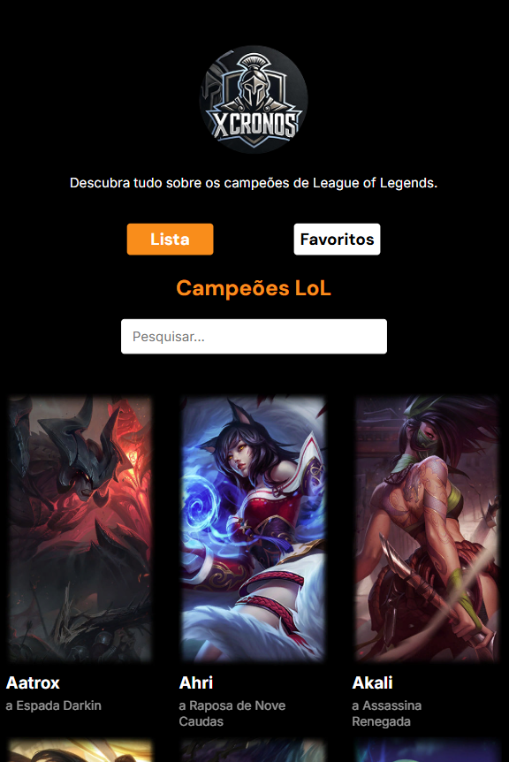
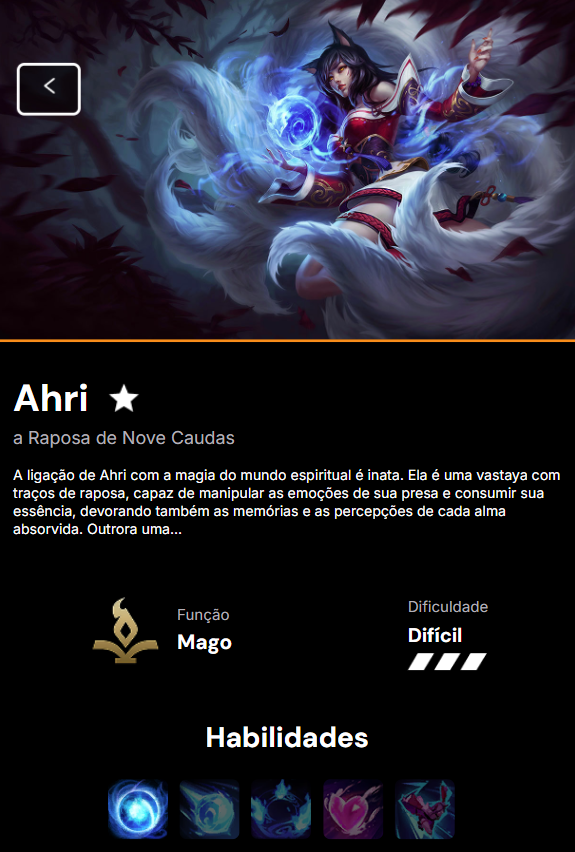
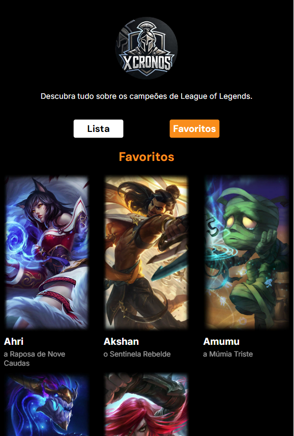

# 🧙‍♂️ Lista de Campeões do League of Legends

Este é um projeto desenvolvido em **React + TypeScript + Vite** que consome a API do League of Legends (DDragon) para exibir uma lista completa de campeões, com busca, visualização de detalhes e sistema de favoritos.

## 🔥 Funcionalidades

- ✅ **Visualização de todos os campeões** com nome, título e imagem
- 🔍 **Campo de busca** para filtrar campeões em tempo real
- ⭐ **Favoritar campeões**, com persistência em `localStorage`

- 📄 **Página de detalhes** com:
  - Imagem splash oficial
  - Nome e título do campeão
  - Descrição (blurb)
  - Função traduzida (Ex: "Mage" → "Mago")
  - Dificuldade visual por estrelas
  - Lista de habilidades com ícones e vídeo demonstrativo de cada uma

## 🧩 Estrutura dos Componentes

- `Champs.tsx` – Página principal com busca e exibição da lista de campeões
- `Champ.tsx` – Página de detalhes de cada campeão, com vídeos e botão de favoritar
- `Favoritos.tsx` – Página com todos os campeões marcados como favoritos

## 📦 Tecnologias Utilizadas

- [React](https://react.dev/)
- [TypeScript](https://www.typescriptlang.org/)
- [Vite](https://vitejs.dev/)
- [React Router](https://reactrouter.com/)
- API pública DDragon (Riot Games)

## 🖼️ Screenshots

### Página Inicial

### Página de Detalhes

### Favoritos

